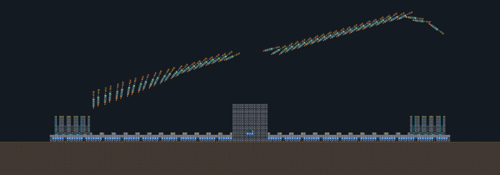
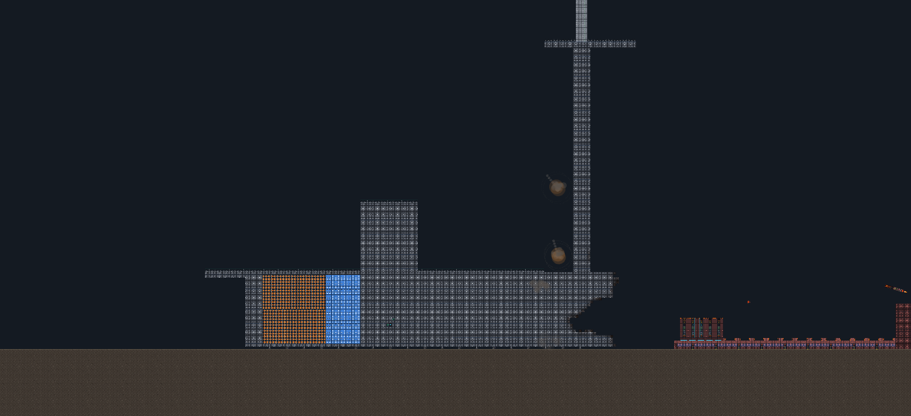
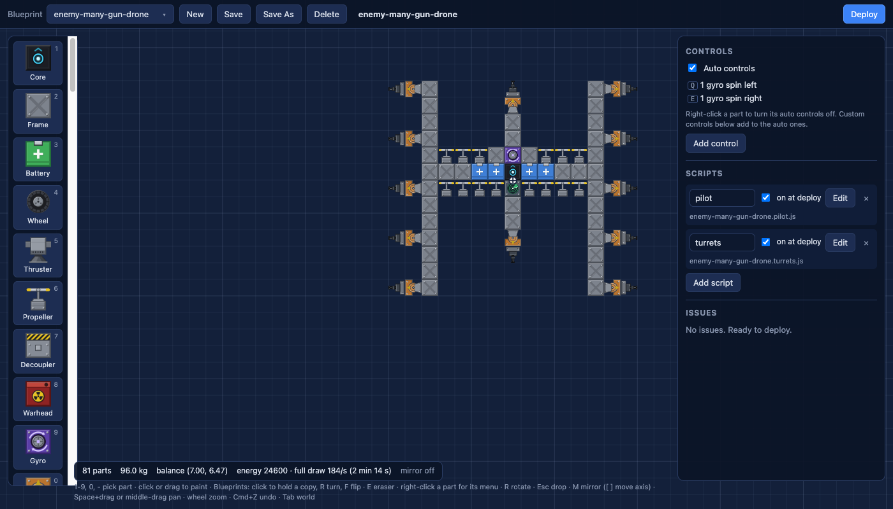

# Robots

Robots is a 2D robot sandbox game that runs in the browser. You build robots from parts on a grid, control them with keybinds or scripts, and deploy them into a physics world to drive, fly, and fight.

This was a fun project I made with Claude in my spare time.

*A 3 tonne ground base releases 48 guided darts in the first two seconds of a match.*

## Contents of the game

- **Builder.** You place parts onto the building grid to make a robot. There are 30+ types of parts, including frames, wheels, propellers, boosters, batteries, gyros, radars, and fabricator bays. You can assign different keybinds to specific part actions, such as using W to activate a propeller, or write scripts to run any arbitrary logic you want.
- **Physics world.** The simulation is deterministic: it uses a fixed time step and seeded random numbers, so the same input always gives the same result. Every part has health, a damaged robot breaks into pieces, and any piece that still has a core keeps operating.
- **Scripts.** A robot can run small JavaScript programs in a sandbox. Each program runs once per tick and reads the robot's sensors as input. The enemy robots use scripts to fly, aim their guns, and build copies of other robots.
- **Headless runner.** Everything the app does can also run from the command line, so you can build and test a robot without opening a browser.
- **Fabricator bay.** A fabricator bay is a part that uses its robot's energy to build a copy of another blueprint, then releases that copy into the world.

*A 20 tonne robot with 5165 parts drives toward a base at 55 m/s while missiles hit its thick armored shell.*

*A drone with twelve gun turrets, open in the builder.*

## How to run the game

- Run `pnpm install` to install the dependencies.
- Run `pnpm dev` to start the app. Then open http://localhost:5180 in a browser.
- Run `pnpm test` to run all the tests.
- Run `pnpm typecheck` to check the types in each package.

## Headless runner

The blueprints are in the `blueprints/` folder. A blueprint is a JSON file that contains an ASCII grid. Give the name of a blueprint or the path to a file.

- `pnpm sim run car --seconds 5` puts the car in the world and simulates it. Once per second, it prints the core's position, the tilt, and whether the robot is at rest.
- `pnpm sim show showcase` shows the grid, the legend, the mass, the center of mass, and the body structure.
- `pnpm sim parts` shows each part and its function.
- `pnpm sim validate car` shows the problems in a blueprint. The exit code is 1 if there are errors.
- `pnpm sim determinism car --seconds 10` runs the simulation two times and compares the state hashes.
- `pnpm sim duel titan-anvil titan-bastion --ya 60` runs one match between two robots that operate without a player.
- `pnpm sim tournament tournaments/titans.json` runs a match for each pair of robots in a roster. Then it writes a ranking.
- The flags are `--world <path>`, `--seconds <n>`, `--seed <n>`, `--x <n> --y <n>`, and `--json`.
- Run `pnpm sim` to see the full list of commands.

## Builder

The app opens in the builder. Press `Tab` to go between the builder and the world. The world stops while you use the builder.

- To add a part, click it in the palette or press its key. Then click or drag on the grid.
- To remove a part, right-click it. You can also right-drag across parts.
- Press `R` to turn a part. Press `Shift+R` to turn it in the opposite direction. Press `Esc` to release the part.
- When you hold no part, click a part to select it. Drag to select an area. Hold `Shift` to add to the selection.
- Press `Delete` to remove the selected parts. Press `R` to turn them.
- Use the side panel to change the tags, the controls, and the scripts.
- Press `M` to set mirror mode to on or off. In mirror mode, each part that you add also appears on the opposite side of the dashed axis. Press `[` or `]` to move the axis.
- Press `Cmd+Z` to undo. Press `Shift+Cmd+Z` to redo.
- To move the view, hold `Space` and drag. You can also drag with the middle mouse button. Turn the mouse wheel to zoom.
- Blueprints are files in the `blueprints/` folder. **Save** replaces the open blueprint. **Save As** makes a new blueprint and does not change the initial one.
- The app asks for confirmation before you lose changes that are not saved.
- **Deploy** checks the blueprint for errors, then shows an outline of the robot at your cursor in the world. A green outline shows that the robot fits. A red outline shows that it does not fit.
- Click to put the robot in the world. Press `Esc` to cancel.

## World controls

The letter keys and the digit keys control your robot. For example, `A` and `D` move a robot that has wheels.

The toolbar at the bottom has the world controls. These keys also operate them:

- `Space`: pause or continue.
- `.`: do one step.
- `[` and `]`: change the time scale. The range is 0.25x to 4x.
- `,`: make the camera follow your robot again, or move it to the next robot.
- `\`: show or hide the debug outlines.
- `` ` ``: show or hide the grid.

The **Clear robots** button on the toolbar removes all the robots. It asks for confirmation first.

Turn the mouse wheel to zoom. Drag to move the view.

## Structure of the project

- `packages/sim-core` contains the simulation. It is plain TypeScript with no browser code, so it runs unchanged in Node.js. It uses Rapier 2D for physics and QuickJS to run scripts.
- `packages/app` contains the browser game. It uses PixiJS, Preact, and Vite.
- `packages/cli` contains the headless runner.
- `blueprints/` contains each robot as a JSON file and its script files.
- `worlds/` contains the terrain files.
- `docs/` contains the documents. The design documents are in `docs/design/`. Start with `00-index.md`.
- `docs/claude-robot-playbook.md` tells you how to make robots.

Parts are data: to add a part, you add a definition file, and the engine code never refers to a part by name.

The tests store hashes of the simulation state, so a change that alters the simulation by accident makes a test fail.

## Art

The sprites are placeholders generated by a script. Run `pnpm --filter @robots/app gen:assets` to write them to `packages/app/public/assets/`.

To use real art, replace the PNG files and the sheet JSON files. The code uses only the frame names.
